# Compactação e Backup

## 🎯 Objetivos da Aula
- [ ] Compreender os conceitos de Compactação e Backup
- [ ] Praticar comandos no terminal
- [ ] Resolver desafios propostos

## 📊 Visão Geral

```mermaid
graph TD
    A[Início] --> B[Conceito]
    B --> C[Prática]
    C --> D[Projeto]
```


## 🧠 Conceito
O Linux é um sistema...

!!! info "Conceito"
    Linux é o núcleo (kernel) de um sistema operacional livre.

## 💻 Prática Terminal
```termynal-exec
ls -la
pwd
```

!!! tip "Dica"
    Use sempre a tecla `Tab` para completar comandos.

## 🚀 Mini-Projeto
Desenvolva um pequeno tutorial sobre...

---
## 🎯 Próximos Passos

<div class="grid cards" markdown>

-   :material-presentation: **Acessar Slides**
    -   [Ver Slides da Aula](../slides/slide-09.html)

-   :material-school: **Quiz**
    -   [Responder Quiz](../quizzes/quiz-09.md)

-   :material-dumbbell: **Exercícios**
    -   [Lista de Exercícios](../exercicios/exercicio-09.md)

-   :material-rocket: **Projeto**
    -   [Mini Projeto](../projetos/projeto-09.md)

</div>
