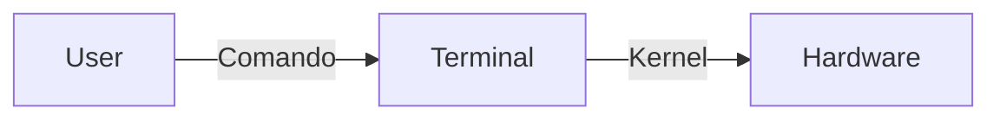

# Projeto Final
## Aula 16 🐧

---

## Objetivos
- Entender Projeto Final { .fragment }
- Aplicar na prática { .fragment }

---

## O que é Projeto Final?
Explicação detalhada aqui.

```bash
# Exemplo de comando
ls /etc
```

---

## Diagrama da Aula


---

## Resumo
- Ponto 1 { .fragment }
- Ponto 2 { .fragment }

---

<!-- _class: lead -->
# Próxima Aula: ...
